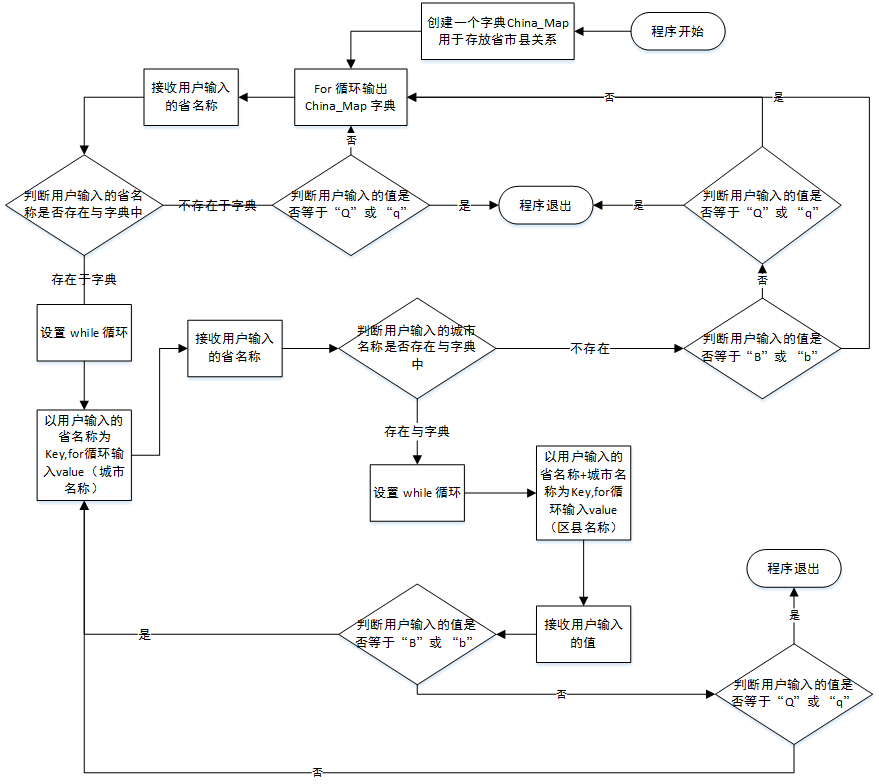

# 脚本名称
## 省市三级联动.py
# 实现功能
    1、 运行程序输出第一级菜单
    2、 选择一级菜单某项，输出二级菜单，同理输出三级菜单\
    4、 让用户选择是否要退出\
    5、 有返回上一级菜单的功能

# 流程图

# 使用说明

# github 地址
    https://github.com/jarvis-all/Old_Boy/tree/master/Day_1/%E7%9C%81%E5%B8%82%E4%B8%89%E7%BA%A7%E8%81%94%E5%8A%A8