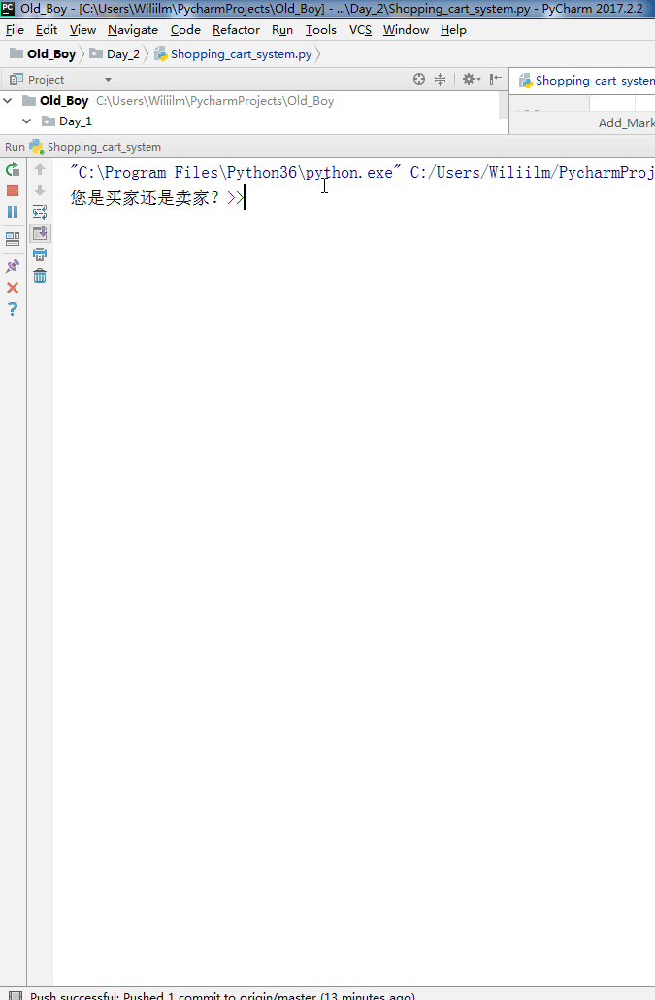

## 脚本名称
    Shopping_cart_system.py
## 实现功能
### 用户入口
    1、商品信息存在文件里
    2、已购商品，余额记录
    3、用户输入“B”or “b”返回上一级
    4、用户输入“”or “q”退出程序并输出已购买的商品和余额
### 商家入口
    1、可以添加商品，更改商品价格
    
## 使用说明

## 博客园地址
    pass
