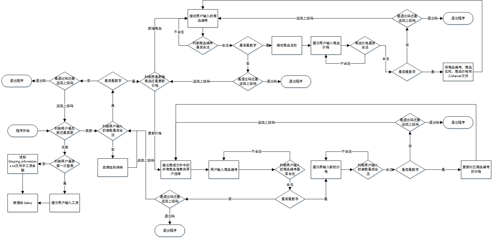

## 脚本名称
    Shopping_cart_system.py
## 实现功能
### 用户入口
    1、商品信息存在文件里
    2、已购商品，余额记录
    3、用户输入“B”or “b”返回上一级
    4、用户输入“”or “q”退出程序并输出已购买的商品和余额
### 商家入口
    1、可以添加商品，更改商品价格
    2、判断商品编号是否存在
    3、添加商品时判断商品编号是否合法（数字即合法）
    4、添加商品和更改商品价格时判断商品价格是否合法（数字即合法）   
## 流程图

## 使用说明

## 博客园地址
    pass
## Github地址
    https://github.com/jarvis-all/Old_Boy/tree/master/Day_2